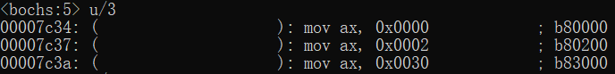

## 检测点8.1

对于以下程序片段, 假如section.data1.start=0x60, 则:  
```
section data1 align = 16 vstart = 0
    lba db 0x55, 0xf0

section data2 align = 16 vstart = 0
    lbb db 0x00, 0x90
    lbc dw 0xf000

section data3 align = 16
    lbd dw 0xfff0, 0xfffc
```  

1. section.data2.start=(`0x70`)  
因为data2设置了16字节对齐, 并且data1的地址为0x60, 占据2字节的内容, 所以data1结束地址应为0x61, 也就是`data1[0x60, 0x61]`, 所以section.data2.start = `0x70`

2. section.data3.start=(`0x80`)  
同理, data2占据4字节, `data2[0x70, 0x73]`, 因为data3为16字节对齐, 所以起始地址为`0x80`

3. 执行mov ax, lba指令后, 寄存器AX中的内容是多少?  
编写[8_1.asm](8_1.asm)并利用bochs测试  
    
根据mov指令的特性, 目的操作数ax为16位寄存器, 所以mov指令会传输2字节的内容给ax, 因为data1指定了vstart=0, 所以lba的偏移地址应从data1开始算起, 所以`ax=0x0000`  

4. 执行mov ax, lbc指令后, 寄存器AX中的内容是多少?  
`ax=0x0003`  
data2指定了vstart=0, 所以lbb的偏移地址为0, lbc的偏移地址为3. 所以`ax=0x0003`  

5. 执行mov ax, lbd指令后, 寄存器AX中的内容是多少?  
`ax=0x0080`  
data3并没有指定vstart, 所以偏移地址从整个段的开头算起, 故`ax=0x0080`  
注意到mov指令并不是直接寻址, 所以源操作数并不会取出内存中的内容, 而是直接取标号的地址.  

## 测试程序 8_1.asm

```
    jmp start

section data1 align=16 vstart=0
    lba db 0x55, 0xf0

section data2 align=16 vstart=0
    lbb db 0x00, 0x90
    lbc dw 0xf000

section data3 align=16 
    lbd dw 0xfff0, 0xfffc

start:
    mov ax, lba
    mov ax, lbc
    mov ax, lbd

    times 0x1fd - 0x3c db 0x00
    dw 0xaa55
```