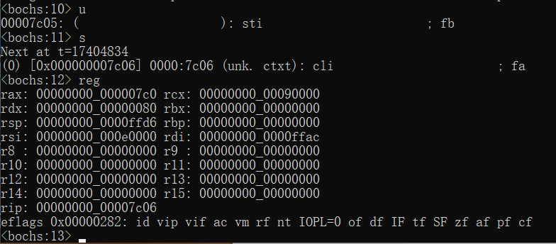

## 检测点 9.1  

编写一个简单的主引导程序, 使用sti与cli指令, 用Bochs观察IF标志位的变化.  
```
; 检测点9.1
; 编写一个简单的程序(主引导记录)使用sti与cli观察IF标志位的变化

section start vstart=0
    mov ax, 0x07c0
    mov ds, ax
    sti
    cli

    times 510 - ($-$$) db 0x00
    dw 0xaa55
```  
- sti(使得IF标志位置1, 允许接受INTR中断)
  

- cli(使得IF标志位置0, 不接受INTR中断)
  
