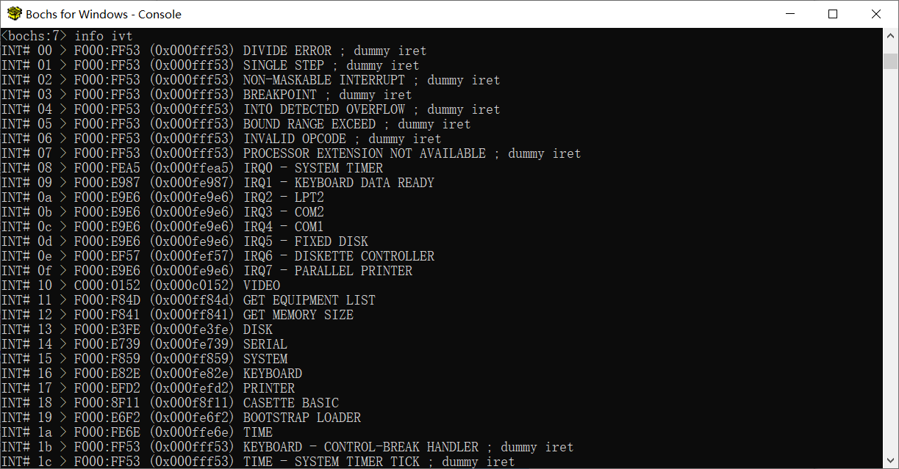
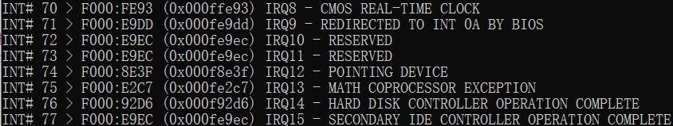
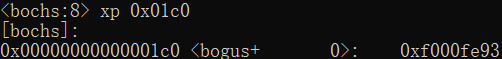

## 检测点 9.2  

- 在Bochs中使用`xp`命令显示实模式下的中断向量表, 并找出0x70号中断处理过程的段地址和偏移地址.  
利用第8章的主引导程序, 启动Bochs来显示.  
在这里可以使用`info ivt`或`xp 0x01c0`或`info ivt 0x70`来显示, 因为中断号为0x70, 所以对应的物理地址应该是`0x70 * 4 = 0x1c0`  
由下图所示, 段地址为0xf000, 偏移地址为0xfe93  
  
  
  
